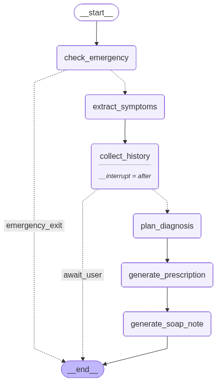
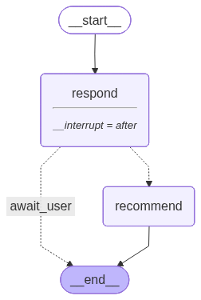

# Sanjeevani

> An AI healthcare assistant that triages general medical complaints
> and supports mental-health conversations through a stateful, multi-agent
> backend and a polished chat UI.


---

## Agent flow at a glance

> Supervisor Multi Agent


The `classify()` function at the top routes each new session into the
physician or therapist sub-graph. Both sub-graphs are real LangGraph
state machines with Postgres-backed checkpoints; the supervisor itself
is intentionally not a graph (see `arch.md` for why).

| | Physician | Therapist |
|---|---|---|
| Flow |  |  |
| `interrupt_after` | `collect_history` | `respond` |
| Termination | `soap_note_generated` or emergency | `recommended` |

---

## Quickstart

You need **Docker** (for Postgres), **Node 20+**, **Python 3.13+**,
and **uv** (or pip).

```bash
# 1. Postgres for the LangGraph checkpointer
docker compose up -d
docker compose ps   # wait for "healthy"

# 2. Backend
cd api
uv sync --extra dev
uv run fastapi dev main.py          # http://localhost:8000

# 3. Frontend (in a new terminal)
cd ..
npm install
npm run dev                          # http://localhost:3000
```

Set `LLM_PROVIDER=gemini` (or `groq`, or `ollama`) in `api/.env`. A
sample lives at `api/.env.example`.

---

## Tech stack

**Frontend** — Next.js 15 (App Router), React 19, TypeScript, Tailwind,
Framer Motion, shadcn/ui, HeyGen streaming avatar.

**Backend** — FastAPI, LangGraph, LangChain, Pydantic, ChromaDB, NCBI E-utilities.

**Infra** — Postgres 16 (docker-compose), uv for Python deps.

---

## API surface (one-screen summary)

| Method | Path | Purpose |
|---|---|---|
| `GET` | `/doctors/` | List available doctor types |
| `POST` | `/diagnosis/{doctor_id}/` | Start a session, returns first question |
| `POST` | `/diagnosis/{session_id}/continue` | Send the user's answer |
| `GET` | `/diagnosis/{session_id}/history` | Q&A history |
| `GET` | `/diagnosis/{session_id}/recommendation` | Final prescription + SOAP note |
| `GET` | `/diagnosis/{session_id}/state` | Debug — raw state snapshot |
| `GET` | `/health` | Liveness |

Full request/response shapes are documented inline in `api/main.py`.

---

## Repository layout

```
.
├── app/                    Next.js App Router
├── components/             React components + shadcn/ui
├── lib/                    Frontend utilities
├── api/                    FastAPI + LangGraph backend
│   ├── main.py             Endpoints
│   ├── config.py           LLM, embeddings, checkpointer
│   ├── agents/             LangGraph state, sub-graphs, nodes, tools
│   ├── doctors/            Shared Pydantic schemas
│   ├── tests/              pytest unit tests + e2e smoke
│   └── utils/              Image analysis, web search helpers
├── arch.md                 Architecture deep-dive
├── AGENTS.md               Dev commands and code style
└── docker-compose.yml      Postgres for the checkpointer
```

---

## Running tests

```bash
cd api
uv run pytest                    # all unit tests
uv run pytest -k emergency       # just the emergency short-circuit
python tests/e2e_smoke.py        # end-to-end against a live API process
```

By default unit tests use `MemorySaver`. Set `POSTGRES_URL` to exercise
the real Postgres checkpointer path.

---

## License

MIT.
