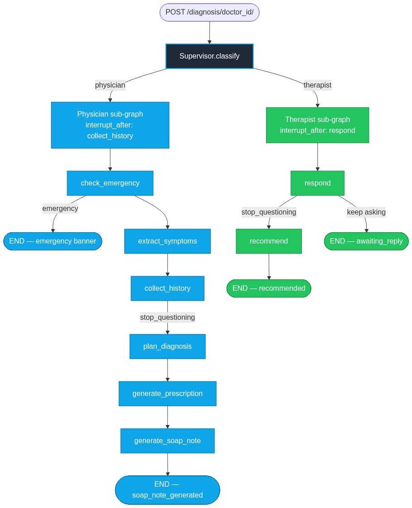

# Sanjeevani — Architecture

> Last updated: June 2026

This document describes how the Sanjeevani healthcare assistant is built.
For day-to-day dev commands, see `AGENTS.md`. For product framing and a
short pitch, see the top-level `README.md`.

---

## 1. Product at a glance

Sanjeevani is an AI healthcare assistant with two front-doors:

- **Physician** — general medical triage. Asks OLDCARTS-style clarifying
  questions, generates a prescription and SOAP note, and short-circuits
  to an emergency banner if red-flag symptoms are detected.
- **Therapist** — mental-health support. Empathetic conversation with a
  closing self-care recommendation.

Both flows share the same chat UI (`app/chat/{physician,therapist}/page.tsx`),
the same FastAPI surface, and the same Postgres-backed state machine.
The supervisor picks the right sub-graph for each session.



---

## Visual reference

The diagrams in this document are rendered from the source-of-truth
graph definitions in `api/agents/`. To regenerate them:

```bash
cd api
uv run python render_graphs.py
```

Outputs land in `api/assets/` (`physician_graph.png`,
`therapist_graph.png`, `supervisor_flow.png` + matching `.mmd`).

---

## 2. Top-level layout

```
┌──────────────────────────────┐        ┌──────────────────────────────┐
│   Next.js 15 frontend        │  HTTP  │   FastAPI backend            │
│   (App Router, React 19,     │ ─────▶ │   (LangGraph 0.3)            │
│   Tailwind, Framer Motion)   │        │                              │
└──────────────────────────────┘        └──────────────┬───────────────┘
                                                      │
                                          ┌───────────▼────────────┐
                                          │  Supervisor (function) │
                                          │  classify() → physician │
                                          │             or therapist│
                                          └────┬───────────────┬───┘
                                               │               │
                                  ┌────────────▼─┐    ┌───────▼──────────┐
                                  │ Physician    │    │  Therapist       │
                                  │ sub-graph    │    │  sub-graph       │
                                  └─────┬────────┘    └──────┬──────────┘
                                        │                    │
                                        └────────┬───────────┘
                                                 │
                                    ┌────────────▼─────────────┐
                                    │  Postgres 16             │
                                    │  (LangGraph checkpointer)│
                                    └──────────────────────────┘

                                    ┌──────────────────────────┐
                                    │  ChromaDB (vector store)  │
                                    │  + NCBI PubMed (RAG tool) │
                                    └──────────────────────────┘
```

- **Frontend** (`app/`, `components/`, `lib/`): Next.js 15 App Router,
  React 19, Tailwind, Framer Motion, shadcn/ui primitives.
- **Backend** (`api/`): FastAPI on top of LangGraph 0.3 sub-graphs.
- **Persistence**: Postgres 16 via `docker-compose.yml`, schema managed
  by `langgraph-checkpoint-postgres`. No in-memory fallback — the API
  hard-fails at startup if Postgres is unreachable.
- **Knowledge**: ChromaDB (semantic search) and NCBI PubMed (live
  E-utilities), wrapped as LangChain `@tool` instances.

---

## 3. Backend request lifecycle

```
client  POST /diagnosis/{doctor_id}/            client  POST /diagnosis/{session_id}/continue
   │                                                       │
   │                                                       │
   ▼                                                       ▼
┌──────────────┐                                  ┌──────────────────────┐
│  supervisor  │                                  │  thread_id lookup    │
│  .classify() │                                  │  physician:session   │
│  (validates) │                                  │  therapist:session   │
└──────┬───────┘                                  └────────┬─────────────┘
       │                                                  │
       │ pick physician | therapist                       │ feed user answer
       ▼                                                  ▼
┌──────────────────┐                            ┌─────────────────────────┐
│  build_subgraph()│                            │  graph.invoke(state,…)  │
│  (compiles once) │                            │  → re-runs paused node  │
│  + checkpointer  │                            │  graph.invoke(None,…)   │
└──────┬───────────┘                            │  → advances past next  │
       │                                        │    interrupt_after      │
       │ graph.invoke(initial_state, …)         └────────┬────────────────┘
       │ → first node runs                              │
       │ → interrupt_after pauses                       │
       ▼                                                ▼
   snapshot                                            snapshot
   → JSON response                              → JSON response
```

### Why the supervisor is a function, not a graph

A nested `StateGraph(parent) → StateGraph(child)` causes the parent to
pause at the wrapper node (`run_physician`) rather than at the child's
actual interrupt point. That breaks the "what question is the doctor
asking right now?" lookup that `/continue` needs.

The idiomatic LangGraph multi-agent pattern is:

- A plain Python `classify()` function that picks the sub-graph.
- One compiled `StateGraph` per agent, each with its own `checkpointer`.
- The API layer invokes the sub-graph directly, threading
  `{doctor_type}:{session_id}` as the LangGraph `thread_id`.

This keeps the interrupt points observable and lets the two sub-graphs
share a Postgres checkpointer without colliding on `session_id`.

---

## 4. Physician sub-graph

```
START
  → check_emergency
       └─ emergency detected  → END  (terminal: is_emergency=True)
  → extract_symptoms
  → collect_history        (interrupt_after; pauses for human)
  → plan_diagnosis         (only if stop_questioning)
  → generate_prescription
  → generate_soap_note
  → END
```

| Node | Inputs | Outputs |
|---|---|---|
| `check_emergency` | `symptoms`, `visual_medical_analysis` | `is_emergency`, `emergency_message` |
| `extract_symptoms` | raw symptoms | `extracted_symptoms` (structured) |
| `collect_history` | symptoms + history | `clarification_question`, `stop_questioning`, `reason_for_stopping` |
| `plan_diagnosis` | full history | `differential_diagnoses`, `sources` |
| `generate_prescription` | plan + RAG context | `prescription` (MedicinePrescription) |
| `generate_soap_note` | plan + prescription | `soap_note` (SOAPNote) |

### Termination guarantees

- The `collect_history` node enforces a **max-turns guard (8 turns)**
  so the question loop terminates deterministically, even if the LLM
  keeps saying "I need more information."
- The `route_after_emergency` conditional edge short-circuits the
  whole graph if a red flag is detected, so the user gets the
  emergency banner immediately.

### `interrupt_after` semantics

`interrupt_after=["collect_history"]` is what makes the multi-turn
chat pattern work. After each user reply, the API does **two** graph
invokes:

1. `graph.invoke(state_updates, config)` — re-runs the paused node
   with the new state (e.g. the patient's answer is now in
   `conversation_history`).
2. `graph.invoke(None, config)` — advances past the next
   `interrupt_after` pause that the conditional edge produced.

For the physician, we detect "still paused" by checking
`current_step` is anything other than `soap_note_generated` (or an
emergency terminal). This is encoded once in `main.py:_continue` and
works for both sub-graphs.

---

## 5. Therapist sub-graph

```
START
  → respond                (interrupt_after; pauses for human)
       └─ stop_questioning=True  → recommend
       └─ stop_questioning=False → END
  → recommend
  → END
```

| Node | Inputs | Outputs |
|---|---|---|
| `respond` | history + patient details | `therapist_reply`, `coping_strategy`, `stop_questioning` |
| `recommend` | full history | `recommendation` (self-care summary) |

The therapist graph reuses the same `{doctor_type}:{session_id}`
thread-id namespacing and the same two-invoke pattern as the physician.

---

## 6. State and persistence

### `api/agents/state.py`

Three `TypedDict`s describe the in-flight state:

- `PhysicianState` — every field the physician nodes read or write.
- `TherapyState` — therapist-specific fields.
- `SupervisorState` — top-level routing state (currently used only by
  the classifier prompt; the API layer doesn't keep one).

`make_initial_*` helpers construct the initial state for each flow
from a `PatientDetails` Pydantic model.

### Postgres checkpointer

`config.get_checkpointer()` returns a module-level singleton built
from a long-lived `psycopg.Connection`. We don't use
`PostgresSaver.from_conn_string()` because it is a `@contextmanager`
that closes the connection on exit.

The checkpointer's tables (`checkpoints`, `checkpoint_blobs`,
`checkpoint_writes`, `checkpoint_migrations`) are created automatically
the first time the checkpointer runs `.setup()`.

The API hard-fails at startup if the connection fails, so a misconfigured
deployment can't silently degrade to in-memory state.

---

## 7. Tools (`api/agents/tools/`)

All LLM-callable tools are decorated with `@tool` so they work with
both `ToolNode` and `llm.bind_tools`. Wrapped in a small
`JsonSerializableTool` mixin when a JSON-string output is required.

| Tool | Backed by | Used by |
|---|---|---|
| `emergency_tool` | regex over user input | `check_emergency` |
| `pubmed_tool` | NCBI E-utilities | `plan_diagnosis`, `generate_prescription` |
| `vector_store_tool` | ChromaDB (cached) | same as above |
| `rag_tool` | composite PubMed + vector | `generate_prescription` |

The old imperative clients (`api/emergency_checker.py`,
`api/pubmed_client.py`, `api/vector_store.py`, `api/rag/`) are gone;
the new tools are the single source of truth.

---

## 8. Pydantic schemas (`api/doctors/models.py`)

Single source of truth for everything that crosses the FastAPI
boundary or is sent to the LLM via `with_structured_output`:

- `PatientDetails` — POST body for `/diagnosis/{doctor_id}/`
- `ClarificationAnswers` — POST body for `/continue`
- `ExtractedSymptoms`, `HistoryQuestionResponse`, `DiagnosisPlan`,
  `MedicinePrescription`, `SOAPNote` — LLM structured outputs
- `TherapyResponse` — therapist LLM output

The legacy `AgentStateModel` / `DoctorResponse` aliases are removed.

---

## 9. API surface

| Method | Path | Purpose |
|---|---|---|
| GET | `/` | Liveness banner |
| GET | `/doctors/` | List available doctor types |
| GET | `/health` | Liveness probe |
| POST | `/diagnosis/{doctor_id}/` | Start a session (returns first question) |
| POST | `/diagnosis/{session_id}/continue` | Send the user's answer |
| GET | `/diagnosis/{session_id}/history` | Q&A history (question/answer pairs) |
| GET | `/diagnosis/{session_id}/recommendation` | Final diagnosis, prescription, SOAP note |
| GET | `/diagnosis/{session_id}/state` | Debug — raw state snapshot |

All paths return the same JSON shapes the previous version did, so the
Next.js frontend is unchanged.

---

## 10. Frontend

```
app/
├── page.tsx                  ← landing
├── doctorselection.tsx       ← "physician vs. therapist" chooser
├── selection/                ← (legacy alt chooser)
├── chat/
│   ├── physician/page.tsx    ← physician chat UI
│   └── therapist/page.tsx    ← therapist chat UI
├── api/                      ← Next.js API proxies (Heygen avatar, etc.)
└── layout.tsx
```

- React 19 + App Router, Tailwind, Framer Motion, shadcn/ui
  (`components/ui/`).
- `components/InteractiveAvatar.tsx` integrates HeyGen streaming avatar
  for the therapist face.
- `app/api/get-access-token` and `app/api/chat/{physician,therapist}`
  are the Next.js edges into the FastAPI backend.

---

## 11. Test strategy

- `api/tests/test_physician_graph.py` — compiles the graph, runs a
  full diagnosis, and checks the emergency short-circuit.
- `api/tests/test_therapist_graph.py` — compiles and runs to
  recommendation.
- `api/tests/e2e_smoke.py` — hits the live FastAPI process with stubbed
  LLM nodes, exercises both sub-graphs end-to-end against a real
  Postgres checkpointer.

Default: `MemorySaver` for unit tests (fast, no infra). Set
`POSTGRES_URL` to exercise the Postgres path.
